<br>
<head>
    <!-- <style>
        figure {
            border: 1px #cccccc solid;
            padding: 4px;
            margin: auto;
        }
        figcaption {
            background-color: black;
            color: white;
            font-style: italic;
            padding: 2px;
            text-align: center;
        }
        /* <figure>
            
            <figcaption>Fig.1 - Trulli, Puglia, Italy</figcaption>
        </figure> */
    </style> -->
    <!-- <style type="text/css">
        .avoid {
            page-break-inside: avoid !important;
            margin: 4px 0 4px 0;  /* to keep the page break from cutting too close to the text in the div */
        }
    </style> -->
    <!--  -->
</head>

<center>
    <h1 style="display: block;">
        GraspSAM: When Segment Anything Model Meets Grasp Detection<br>
    </h1>
    <br>
    <!-- published in in 24' IEEE RA-L <br> -->
    <!-- <br> -->
    <!-- Authors ---- ---- ---- ----      ---- ---- ---- ----      ---- ---- ---- ----      ---- ---- ---- ---- -->
    <table style="border: none; display: initial;">
        <tbody>
            <tr style="border: none;">
                <td style="border: none;"><a href="mailto:sangjun7@gm.gist.ac.kr">Sangjun Noh</a></td>
                <td style="border: none;"><a href="mailto:jongwonkim@gm.gist.ac.kr">Jongwon Kim</a></td>
                <td style="border: none;"><a href="mailto:namdongwoo@gm.gist.ac.kr">Dongwoo Nam</a></td>
                <td style="border: none;"><a href="mailto:shback@gm.gist.ac.kr">Seunghyeok Back</a></td>
                <td style="border: none;"><a href="mailto:raeyo@gm.gist.ac.kr">Raeyoung Kang</a></td>
                <td style="border: none;"><a href="mailto:kyoobinlee@gist.ac.kr">Kyoobin Lee</a><sup>†</sup></td>
            </tr>
        </tbody>
    </table>
    <br>
    <table style="border: none; display: initial;">
        <tbody>
            <tr style="border: none;">
                <td style="border: none;">
                    <sup>†</sup>Corresponding author
                </td>
            </tr>
        </tbody>
    </table>
    <br>
    <table style="border: none; display: initial;">
        <tbody>
            <tr style="border: none;">
                    <sup>1</sup>Gwangju Institute of Science and Technology (GIST)
            </tr>
        </tbody>
    </table>
    <br>
    <br>
    <!-- Links ---- ---- ---- ----      ---- ---- ---- ----      ---- ---- ---- ----      ---- ---- ---- ---- -->
    <table style="border: none; display: initial;">
        <tbody>
            <tr style="border: none;">
                <td style="border: none;">
                    <a href="https://arxiv.org/abs/2409.12521" style="color: #ffffff">
                        <div class="link_button">
                            <i class="bi bi-file-earmark-richtext"></i> Paper
                        </div>
                    </a>
                </td>
                <td style="border: none;"></td> <!-- intervals -->
                <td style="border: none; display: initial;">
                    <a href="https://github.com/gist-ailab/GraspSAM.git" style="color: #ffffff">
                        <div class="link_button">
                            <i class="bi bi-github"></i> Code
                        </div>
                    </a>
                </td>
            </tr>
        </tbody>
    </table>
    <br>
    <table style="border: none; display: initial;">
        <tbody>
            <tr style="border: none;">
                <td style="border: none;">( Official code will be released )</td>
            </tr>
        </tbody>
    </table>
</center>

<br>
<br>
<br>
<br>

<!-- Paper contents ---- ---- ---- ----      ---- ---- ---- ----      ---- ---- ---- ----      ---- ---- ---- ---- -->

# Abstract

  Grasp detection requires flexibility to handle objects of various shapes without relying on prior object knowledge, while also offering intuitive, user-guided control. In this paper, we introduce GraspSAM, an innovative extension of the Segment Anything Model (SAM) designed for prompt-driven and category-agnostic grasp detection. Unlike previous methods, which are often limited by small-scale training data, GraspSAM leverages SAM’s large-scale training and prompt-based segmentation capabilities to efficiently support both target-object and category-agnostic grasping. By utilizing adapters, learnable token embeddings, and a lightweight modified decoder, GraspSAM requires minimal fine-tuning to integrate object segmentation and grasp prediction into a unified framework. Our model achieves state-of-the-art (SOTA) performance across multiple datasets, including Jacquard, Grasp-Anything, and Grasp-Anything++. Extensive experiments demonstrate GraspSAM’s flexibility in handling different types of prompts (such as points, boxes, and language), highlighting its robustness and effectiveness in real-world robotic applications.


<br>
<br>
<br>
<br>

# GraspSAM Pipeline

<!-- TODO: add image -->

<center>
    <table style="border: none; display: initial;">
        <tbody>
            <tr style="border: none;">
                <td style="border: none;">
                    
                </td>
            </tr>
        </tbody>
    </table>
</center>

<br>
<br>
<br>
<br>


# GraspSAM Result


<!-- -  **Grasp detection performance of each model given 10 points as prompt.** -->
<!-- | Methods            | Grasp-Anything        |             Grasp-Anything            |        Grasp-Anything                 | Jacquard            |              Jacquard           |         Jacquard                |
| :------------------ | :--------------------- | :----------------------- | :----------------------- | :---------------------- | :----------------------- | :----------------------- |
|          Methods          | Base                  | New                     | H                       | Base                   | New                     | H                       |
| GR-ConvNet*         | 0.68                  | 0.55                    | 0.61                    | 0.82                   | 0.61                    | 0.70                    |
| Det-Seg-Refine* | 0.58                  | 0.53                    | 0.55                    | 0.79                   | 0.55                    | 0.65                    |
| GG-CNN*             | 0.65                  | 0.53                    | 0.58                    | 0.73                   | 0.52                    | 0.61                    |
| LGD*                | 0.69                  | 0.57                    | 0.62                    | 0.83                   | 0.64                    | 0.72                    |
| GraspSAM-tiny (ours)| 0.78                  | 0.75                    | 0.77                    | **0.90**               | 0.81                    | **0.85**                |
| GraspSAM-t (ours)   | **0.83**              | **0.81**                | **0.82**                | 0.87                   | 0.75                    | 0.81                    | -->

### **Grasp detection performance of each model given 10 points as prompt**
<center>
<div style="text-align: center; margin: 0 auto;">
  <table style="width: 100%; margin: 0 auto; text-align: center;">
    <!-- <caption style="font-size: 1.5em;"><strong>Grasp detection performance of each model given 10 points as prompt</strong></caption> -->
    <tr>
      <th rowspan="2" style="width: 16.66%;">Methods</th>
      <th colspan="3" style="width: 25%;">Grasp-Anything</th>
      <th colspan="3" style="width: 25%;">Jacquard</th>
    </tr>
    <tr>
      <!-- <th style="width: 16.66%;"></th> -->
      <th style="width: 8.33%;">Base</th>
      <th style="width: 8.33%;">New</th>
      <th style="width: 8.33%;">H</th>
      <th style="width: 8.33%;">Base</th>
      <th style="width: 8.33%;">New</th>
      <th style="width: 8.33%;">H</th>
    </tr>
    <tr>
      <td style="width: 16.66%;">GR-ConvNet*</td>
      <td style="width: 8.33%;">0.68</td>
      <td style="width: 8.33%;">0.55</td>
      <td style="width: 8.33%;">0.61</td>
      <td style="width: 8.33%;">0.82</td>
      <td style="width: 8.33%;">0.61</td>
      <td style="width: 8.33%;">0.70</td>
    </tr>
    <tr>
      <td style="width: 16.66%;">Det-Seg-Refine*</td>
      <td style="width: 8.33%;">0.58</td>
      <td style="width: 8.33%;">0.53</td>
      <td style="width: 8.33%;">0.55</td>
      <td style="width: 8.33%;">0.79</td>
      <td style="width: 8.33%;">0.55</td>
      <td style="width: 8.33%;">0.65</td>
    </tr>
    <tr>
      <td style="width: 16.66%;">GG-CNN*</td>
      <td style="width: 8.33%;">0.65</td>
      <td style="width: 8.33%;">0.53</td>
      <td style="width: 8.33%;">0.58</td>
      <td style="width: 8.33%;">0.73</td>
      <td style="width: 8.33%;">0.52</td>
      <td style="width: 8.33%;">0.61</td>
    </tr>
    <tr>
      <td style="width: 16.66%;">LGD*</td>
      <td style="width: 8.33%;">0.69</td>
      <td style="width: 8.33%;">0.57</td>
      <td style="width: 8.33%;">0.62</td>
      <td style="width: 8.33%;">0.83</td>
      <td style="width: 8.33%;">0.64</td>
      <td style="width: 8.33%;">0.72</td>
    </tr>
    <tr>
      <td style="width: 16.66%;">GraspSAM-tiny (ours)</td>
      <td style="width: 8.33%;">0.78</td>
      <td style="width: 8.33%;">0.75</td>
      <td style="width: 8.33%;">0.77</td>
      <td style="width: 8.33%;"><strong>0.90</strong></td>
      <td style="width: 8.33%;">0.81</td>
      <td style="width: 8.33%;"><strong>0.85</strong></td>
    </tr>
    <tr>
      <td style="width: 16.66%;">GraspSAM-t (ours)</td>
      <td style="width: 8.33%;"><strong>0.83</strong></td>
      <td style="width: 8.33%;"><strong>0.81</strong></td>
      <td style="width: 8.33%;"><strong>0.82</strong></td>
      <td style="width: 8.33%;">0.87</td>
      <td style="width: 8.33%;">0.75</td>
      <td style="width: 8.33%;">0.81</td>
    </tr>
  </table>
</div>
</center>


<br>


<!-- -  **Grasp detection performance of each model given 10 points as prompt.** -->
<!-- | Methods                 | Grasp-anthing ++     |                       |                       |
| ----------------------- | ---------------------| --------------------- | --------------------- |
|                         | Base                 | New                   | H                     |
| CLIPORT                 | 0.36                 | 0.26                  | 0.29                  |
| CLIPGrasp               | 0.40                 | 0.29                  | 0.33                  |
| LGD                     | 0.48                 | 0.42                  | 0.45                  |
| GraspSAM w/ G.D (Ours)  | **0.64**             | **0.62**              | **0.63**              | -->

### **Grasp dection performance comparison when using language as a prompt**
<center>
<!-- <div style="center; margin: 0 auto;"> -->
<table style="width: 80%; center;">
<!-- <caption style="font-size: 1.5em;"><strong>Grasp dection performance comparison when using language as a prompt</strong></caption> -->
<tr>
    <th rowspan="2" style="width: 40%;">Methods</th>
    <th colspan="3" style="width: 60%;">Grasp-anthing ++</th>
</tr>
<tr>
    <!-- <th></th> -->
    <th style="width: 20%;">Base</th>
    <th style="width: 20%;">New</th>
    <th style="width: 20%;">H</th>
</tr>
<tr>
    <td>CLIPORT</td>
    <td>0.36</td>
    <td>0.26</td>
    <td>0.29</td>
</tr>
<tr>
    <td>CLIPGrasp</td>
    <td>0.40</td>
    <td>0.29</td>
    <td>0.33</td>
</tr>
<tr>
    <td>LGD</td>
    <td>0.48</td>
    <td>0.42</td>
    <td>0.45</td>
</tr>
<tr>
    <td><strong>GraspSAM w/ G.D (Ours)</strong></td>
    <td><strong>0.64</strong></td>
    <td><strong>0.62</strong></td>
    <td><strong>0.63</strong></td>
</tr>
</table>
<!-- </div> -->
</center>


<br>
<br>
<br>
<br>


# Inference GrapSAM in Real World Video
<section class="section">
  <div class="columns is-centered has-text-centered">
      <div style="width:100%;">
        <!-- <div class="columns is-centered has-text-centered">
          <div class="column is-six-fifths">
            <h2 class="title is-3">Inference GrapSAM in Real World Video</h2> 
          </div>
        </div> -->
        <div style="float:left; width:49%; border: 0px solid rgba(5, 130, 255, 0.534);">
            <h2 class="title is-5">Prompt: 1point</h2>
            <div class="column is-five-fifths">
                <div class="columns is-centered">
                    <video width="90%" controls>
                        <source src="./assets/videos/real_1point.mp4" type="video/mp4">
                        Your browser does not support the video tag.
                    </video> 
                </div>
            </div>
        </div>
        <div style=" float:right; width:49%; border: 0px solid black;">
            <h2 class="title is-5">Prompt: 10points</h2>
            <div class="column is-five-fifths">
                <div class="columns is-centered">
                    <video width="90%" controls>
                        <source src="./assets/videos/real_10point.mp4" type="video/mp4">
                        Your browser does not support the video tag.
                    </video> 
                </div>
            </div>
        </div>
        <!-- <br> -->
        <br>
        <div style="float:left; width:49%; border: 0px solid rgba(5, 130, 255, 0.534);">
            <h2 class="title is-5">Prompt: Box</h2>
            <div class="column is-five-fifths">
                <div class="columns is-centered">
                    <video width="90%" controls>
                        <source src="./assets/videos/real_bbox.mp4" type="video/mp4">
                        Your browser does not support the video tag.
                    </video> 
                </div>
            </div>
        </div>
        <div style=" float:right; width:49%; border: 0px solid black;">
            <h2 class="title is-5">Prompt: Language</h2>
            <div class="column is-five-fifths">
                <div class="columns is-centered">
                    <video width="90%" controls>
                        <source src="./assets/videos/real_grounding.mp4" type="video/mp4">
                        Your browser does not support the video tag.
                    </video> 
                </div>
            </div>
        </div>
        <!-- <br> -->
        <br>
        <div style="float:left; width:49%; border: 0px solid rgba(5, 130, 255, 0.534);">
            <h2 class="title is-5">Prompt: Eye Gaze</h2>
            <div class="column is-five-fifths">
                <div class="columns is-centered">
                    <video width="90%" controls>
                        <source src="./assets/videos/real_gaze1.mp4" type="video/mp4">
                        Your browser does not support the video tag.
                    </video> 
                </div>
            </div>
        </div>
      </div>
    </div>
</section>

<br>
<br>
<br>
<br>


## Additional Inference Results

- **Grasp-Anything(Seen)**

<center>
    <table style="border: none; display: initial;">
        <tbody>
            <tr style="border: none;">
                <td style="border: none;">
                    
                </td>
                <td style="border: none;">
                    
                </td>
            </tr>
        </tbody>
    </table>
</center>
<center>
    <table style="border: none; display: initial;">
        <tbody>
            <tr style="border: none;">
                <td style="border: none;">
                    
                </td>
                <td style="border: none;">
                    
                </td>
            </tr>
        </tbody>
    </table>
</center>
<center>
    <table style="border: none; display: initial;">
        <tbody>
            <tr style="border: none;">
                <td style="border: none;">
                    
                </td>
                <td style="border: none;">
                    
                </td>
            </tr>
        </tbody>
    </table>
</center>
<br>

- **Grasp-Anything(Unseen)**

<center>
    <table style="border: none; display: initial;">
        <tbody>
            <tr style="border: none;">
                <td style="border: none;">
                    
                </td>
                <td style="border: none;">
                    
                </td>
            </tr>
        </tbody>
    </table>
</center>
<center>
    <table style="border: none; display: initial;">
        <tbody>
            <tr style="border: none;">
                <td style="border: none;">
                    
                </td>
                <td style="border: none;">
                    
                </td>
            </tr>
        </tbody>
    </table>
</center>
<center>
    <table style="border: none; display: initial;">
        <tbody>
            <tr style="border: none;">
                <td style="border: none;">
                    
                </td>
                <td style="border: none;">
                    
                </td>
            </tr>
        </tbody>
    </table>
</center>
<br>

- **Armbench**

<center>
    <table style="border: none; display: initial;">
        <tbody>
            <tr style="border: none;">
                <td style="border: none;">
                    
                </td>
                <td style="border: none;">
                    
                </td>
            </tr>
        </tbody>
    </table>
</center>
<center>
    <table style="border: none; display: initial;">
        <tbody>
            <tr style="border: none;">
                <td style="border: none;">
                    
                </td>
                <td style="border: none;">
                    
                </td>
            </tr>
        </tbody>
    </table>
</center>
<center>
    <table style="border: none; display: initial;">
        <tbody>
            <tr style="border: none;">
                <td style="border: none;">
                    
                </td>
                <td style="border: none;">
                    
                </td>
            </tr>
        </tbody>
    </table>
</center>

<br>

- **GraspNet**

<center>
    <table style="border: none; display: initial;">
        <tbody>
            <tr style="border: none;">
                <td style="border: none;">
                    
                </td>
                <td style="border: none;">
                    
                </td>
            </tr>
        </tbody>
    </table>
</center>
<center>
    <table style="border: none; display: initial;">
        <tbody>
            <tr style="border: none;">
                <td style="border: none;">
                    
                </td>
                <td style="border: none;">
                    
                </td>
            </tr>
        </tbody>
    </table>
</center>
<center>
    <table style="border: none; display: initial;">
        <tbody>
            <tr style="border: none;">
                <td style="border: none;">
                    
                </td>
                <td style="border: none;">
                    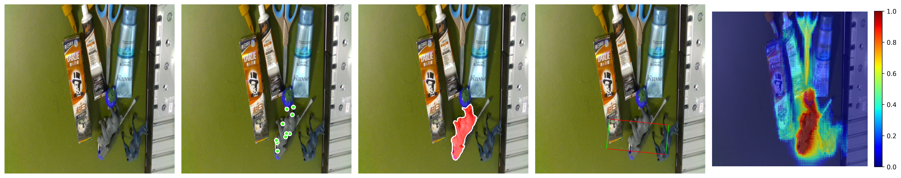
                </td>
            </tr>
        </tbody>
    </table>
</center>

<br>


- **OCID**

<center>
    <table style="border: none; display: initial;">
        <tbody>
            <tr style="border: none;">
                <td style="border: none;">
                    
                </td>
                <td style="border: none;">
                    
                </td>
            </tr>
        </tbody>
    </table>
</center>
<center>
    <table style="border: none; display: initial;">
        <tbody>
            <tr style="border: none;">
                <td style="border: none;">
                    
                </td>
                <td style="border: none;">
                    
                </td>
            </tr>
        </tbody>
    </table>
</center>
<center>
    <table style="border: none; display: initial;">
        <tbody>
            <tr style="border: none;">
                <td style="border: none;">
                    
                </td>
                <td style="border: none;">
                    
                </td>
            </tr>
        </tbody>
    </table>
</center>

<br>

## Real Inference Results

- **1Point**
<center>
    <table style="border: none; display: initial;">
        <tbody>
            <tr style="border: none;">
                <td style="border: none;">
                    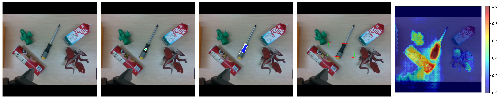
                </td>
                <td style="border: none;">
                    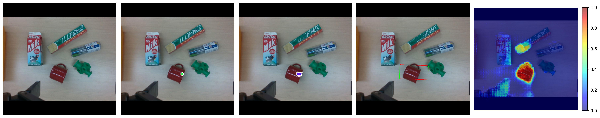
                </td>
            </tr>
        </tbody>
    </table>
</center>
<center>
    <table style="border: none; display: initial;">
        <tbody>
            <tr style="border: none;">
                <td style="border: none;">
                    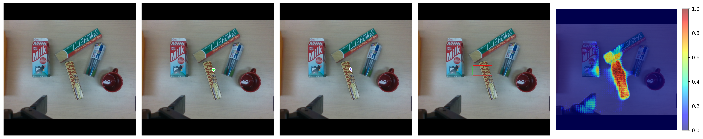
                </td>
                <td style="border: none;">
                    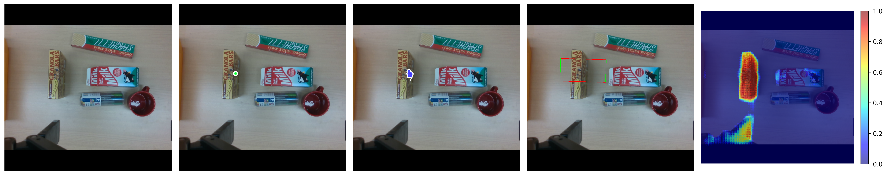
                </td>
            </tr>
        </tbody>
    </table>
</center>
<center>
    <table style="border: none; display: initial;">
        <tbody>
            <tr style="border: none;">
                <td style="border: none;">
                    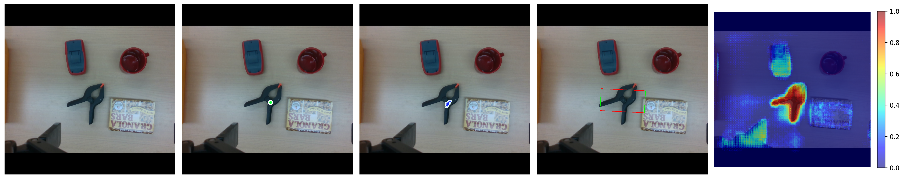
                </td>
                <td style="border: none;">
                    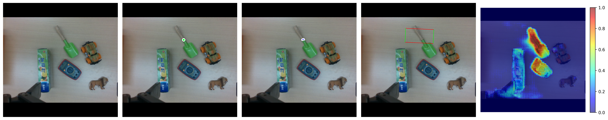
                </td>
            </tr>
        </tbody>
    </table>
</center>
<br>


- **3Points**
<center>
    <table style="border: none; display: initial;">
        <tbody>
            <tr style="border: none;">
                <td style="border: none;">
                    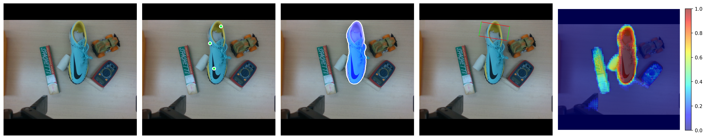
                </td>
                <td style="border: none;">
                    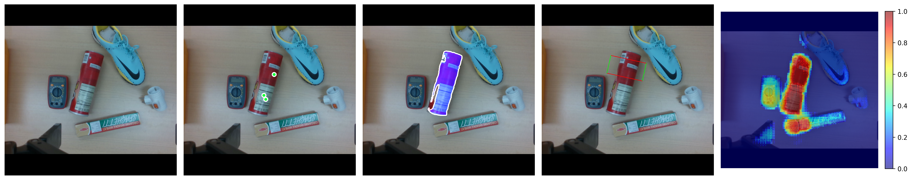
                </td>
            </tr>
        </tbody>
    </table>
</center>
<center>
    <table style="border: none; display: initial;">
        <tbody>
            <tr style="border: none;">
                <td style="border: none;">
                    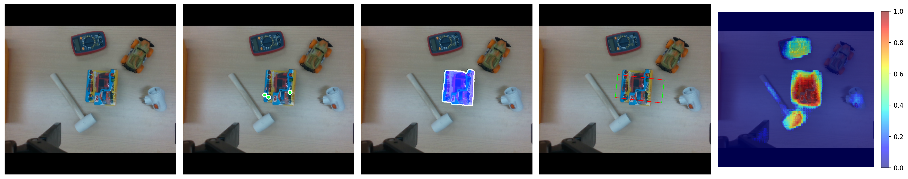
                </td>
                <td style="border: none;">
                    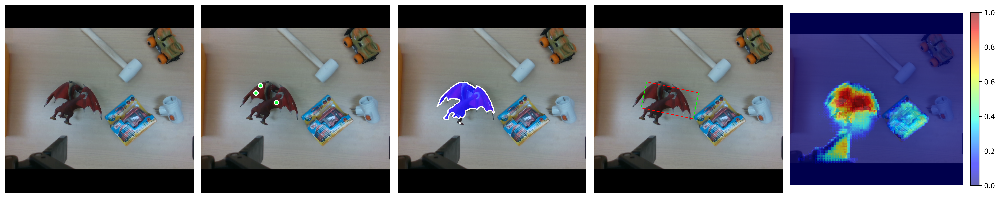
                </td>
            </tr>
        </tbody>
    </table>
</center>
<center>
    <table style="border: none; display: initial;">
        <tbody>
            <tr style="border: none;">
                <td style="border: none;">
                    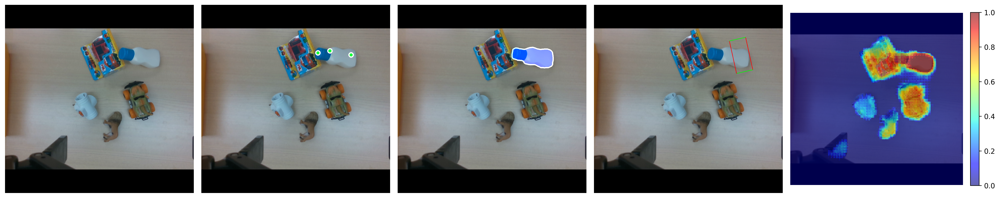
                </td>
                <td style="border: none;">
                    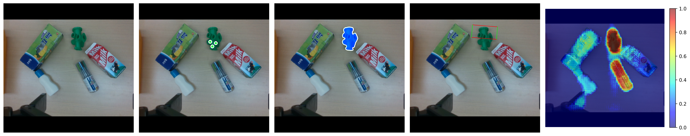
                </td>
            </tr>
        </tbody>
    </table>
</center>
<br>


- **5Points**
<center>
    <table style="border: none; display: initial;">
        <tbody>
            <tr style="border: none;">
                <td style="border: none;">
                    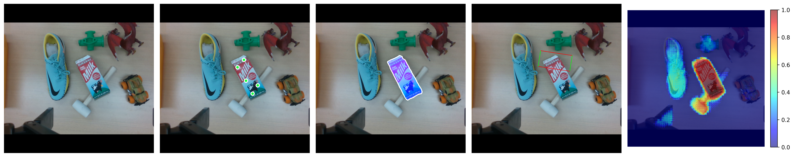
                </td>
                <td style="border: none;">
                    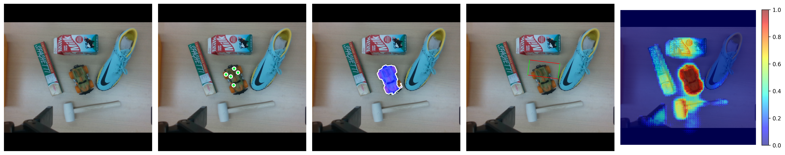
                </td>
            </tr>
        </tbody>
    </table>
</center>
<center>
    <table style="border: none; display: initial;">
        <tbody>
            <tr style="border: none;">
                <td style="border: none;">
                    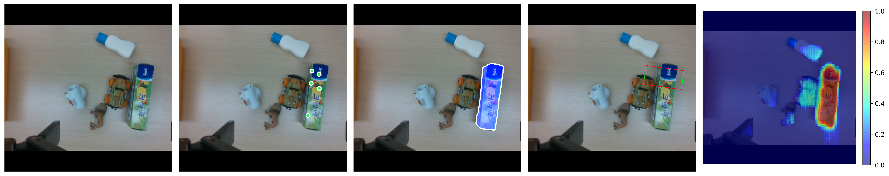
                </td>
                <td style="border: none;">
                    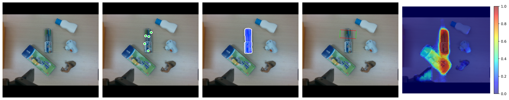
                </td>
            </tr>
        </tbody>
    </table>
</center>
<center>
    <table style="border: none; display: initial;">
        <tbody>
            <tr style="border: none;">
                <td style="border: none;">
                    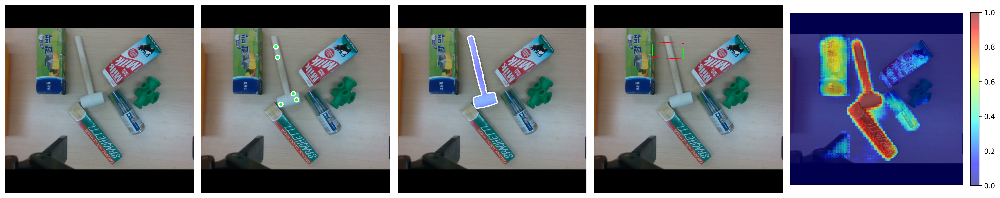
                </td>
                <td style="border: none;">
                    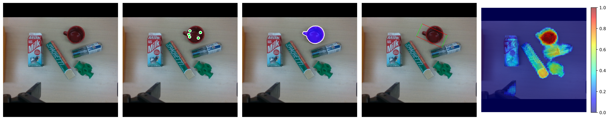
                </td>
            </tr>
        </tbody>
    </table>
</center>
<br>


- **10Points**
<center>
    <table style="border: none; display: initial;">
        <tbody>
            <tr style="border: none;">
                <td style="border: none;">
                    
                </td>
                <td style="border: none;">
                    
                </td>
            </tr>
        </tbody>
    </table>
</center>
<center>
    <table style="border: none; display: initial;">
        <tbody>
            <tr style="border: none;">
                <td style="border: none;">
                    
                </td>
                <td style="border: none;">
                    
                </td>
            </tr>
        </tbody>
    </table>
</center>
<center>
    <table style="border: none; display: initial;">
        <tbody>
            <tr style="border: none;">
                <td style="border: none;">
                    
                </td>
                <td style="border: none;">
                    
                </td>
            </tr>
        </tbody>
    </table>
</center>


<!-- <br> -->
<!-- <br> -->
<!-- <br> -->
<!-- <br> -->
<!-- <hr style="border: solid 1px #c80000;"> -->
<hr style="#c80000;">
<br>
<br>
<br>
<br>

# Citation

```
@article{noh2024graspsam,
  title={GraspSAM: When Segment Anything Model Meets Grasp Detection},
  author={Noh, Sangjun and Kim, Jongwon and Nam, Dongwoo and Back, Seunghyeok and Kang, Raeyoung and Lee, Kyoobin},
  journal={arXiv preprint arXiv:2409.12521},
  year={2024}
}
```

<br>
<br>
<br>
<br>

<!-- # Acknowledgements

  This work was fully supported by the Korea Institute for Advancement of Technology (KIAT) grant funded by the Korea Government (MOTIE) (Project Name: Shared autonomy based on deep reinforcement learning for responding intelligently to unfixed environments such as robotic assembly tasks, Project Number: 20008613).
  This work was also partially supported by the HPC Support project of the Korea Ministry of Science and ICT and NIPA. -->

<br>
<br>
<br>
<br>

# Author Contacts

<center>
Contact email to get more information on this project<br>
<!-- GIST 광주과학기술원 ([gist.ac.kr](https://www.gist.ac.kr/kr/main.html)) | AILAB GIST AILAB  -->
</center>
<center>
<!-- 
<br> -->

<br>
</center>

<br>
<br>

<center>
    [ Address : Dasan Building (C9) 204/206 & Central Research Facilities (C11) 403, <br>
    123 Cheomdangwagi-ro, Buk-gu, Gwangju, 61005, Korea ]
</center>

<br>
<br>

<footer class="footer">
  <div class="container">
    <div class="content has-text-centered">
      <!-- <a class="icon-link"
         href="./static/videos/nerfies_paper.pdf">
        <i class="fas fa-file-pdf"></i>
      </a> -->
      <center>
        <a class="icon-link" href="https://github.com/keunhong" class="external-link" disabled>website format
            <i class="fab fa-github"></i>
        </a>
      </center>
    </div>
    <div class="columns is-centered">
      <div class="column is-8">
        <div class="content">
          <center>
          <p>
            This website format is licensed under <br>
            a <a rel="license" href="http://creativecommons.org/licenses/by-sa/4.0/">Creative Commons Attribution-ShareAlike 4.0 International License</a>.
          </p>
          </center>
          <!-- <p>
            This means you are free to borrow the <a
              href="https://github.com/nerfies/nerfies.github.io">source code</a> of this website,
            we just ask that you link back to this page in the footer.
            Please remember to remove the analytics code included in the header of the website which
            you do not want on your website.
          </p> -->
        </div>
      </div>
    </div>
  </div>
</footer>
