<br>
<head>
    <!-- <style>
        figure {
            border: 1px #cccccc solid;
            padding: 4px;
            margin: auto;
        }
        figcaption {
            background-color: black;
            color: white;
            font-style: italic;
            padding: 2px;
            text-align: center;
        }
        /* <figure>
            
            <figcaption>Fig.1 - Trulli, Puglia, Italy</figcaption>
        </figure> */
    </style> -->
    <!-- <style type="text/css">
        .avoid {
            page-break-inside: avoid !important;
            margin: 4px 0 4px 0;  /* to keep the page break from cutting too close to the text in the div */
        }
    </style> -->
    <!--  -->
</head>

<center>
    <h1 style="display: block;">
        GraspSAM: When Segment Anything Model Meets Grasp Detection<br>
    </h1>
    <!-- <br> -->
    <!-- published in in 24' IEEE RA-L <br> -->
    <!-- <br> -->
    <!-- Authors ---- ---- ---- ----      ---- ---- ---- ----      ---- ---- ---- ----      ---- ---- ---- ---- -->
    <!-- <table style="border: none; display: initial;"> -->
        <!-- <tbody>
            <tr style="border: none;">
                <td style="border: none;"><a href="mailto:sangjun7@gm.gist.ac.kr">Sangjun Noh</a><sup>*</sup></td>
                <td style="border: none;"><a href="mailto:raeyo@gm.gist.ac.kr">Raeyoung Kang</a><sup>*</sup></td>
                <td style="border: none;"><a href="mailto:ailab.ktw@gm.gist.ac.kr">Taewon Kim</a><sup>*</sup></td>
                <td style="border: none;"><a href="mailto:shback@gm.gist.ac.kr">Seunghyeok Back</a></td>
                <td style="border: none;"><a href="mailto:bakseongho@gm.gist.ac.kr">Seongho Bak</a></td>
                <td style="border: none;"><a href="mailto:kyoobinlee@gist.ac.kr">Kyoobin Lee</a><sup>†</sup></td>
            </tr>
        </tbody>
    </table> -->
    <!-- <br> -->
    <!-- <table style="border: none; display: initial;">
        <tbody>
            <tr style="border: none;">
                <td style="border: none;">
                    <sup>†</sup>Corresponding author
                </td>
            </tr>
        </tbody> -->
    <!-- </table> -->
    <!-- <br> -->
    <!-- <table style="border: none; display: initial;">
        <tbody>
            <tr style="border: none;">
                    <sup>1</sup>Gwangju Institute of Science and Technology (GIST)
            </tr>
        </tbody>
    </table> -->
    <!-- <br> -->
    <!-- <br> -->
    <!-- Links ---- ---- ---- ----      ---- ---- ---- ----      ---- ---- ---- ----      ---- ---- ---- ---- -->
    <!-- <table style="border: none; display: initial;"> -->
        <!-- <tbody> -->
            <!-- <tr style="border: none;"> -->
                <!-- <td style="border: none;"> -->
                    <!-- <a href="https://ieeexplore.ieee.org/document/10417128" style="color: #ffffff"> -->
                        <!-- <div class="link_button"> -->
                            <!-- <i class="bi bi-file-earmark-richtext"></i> Paper -->
                        <!-- </div> -->
                    <!-- </a> -->
                <!-- </td> -->
                <!-- <td style="border: none;"></td> intervals -->
                <!-- <td style="border: none;"></td> intervals -->
                <!-- <td style="border: none; display: initial;"> -->
                    <!-- <a href="https://github.com/gist-ailab/uop-net" style="color: #ffffff"> -->
                        <!-- <div class="link_button"> -->
                            <!-- <center> -->
                            <!-- <i class="bi bi-github"></i> Code / Dataset -->
                            <!-- </center> -->
                        <!-- </div> -->
                    <!-- </a> -->
                <!-- </td> -->
            <!-- </tr> -->
        <!-- </tbody> -->
    <!-- </table> -->
    <br>
    <table style="border: none; display: initial;">
        <tbody>
            <tr style="border: none;">
                <td style="border: none;">( Official code will be released )</td>
            </tr>
        </tbody>
    </table>
    <!-- <br> -->
    <!-- <br> -->
    <!-- <br> -->
    <!-- <br> -->
    <!-- PT video ---- ---- ---- ----      ---- ---- ---- ----      ---- ---- ---- ----      ---- ---- ---- ---- -->
    <!-- <video width="75%" controls autoplay muted loop> -->
        <!-- <source src="./assets/20230901_Home-DataGeneration_01.mp4" type="video/mp4">            TODO: add presentation video -->
        <!-- Your browser does not support the video tag. -->
    <!-- </video>  -->
</center>

<br>
<br>
<br>
<br>

<!-- Paper contents ---- ---- ---- ----      ---- ---- ---- ----      ---- ---- ---- ----      ---- ---- ---- ---- -->

# Abstract

  As robots become more integrated into both household and industrial settings, their ability to efficiently grasp diverse objects is essential. In this paper, we introduce GraspSAM, a novel approach that extends the Segment Anything Model (SAM) to perform end-to-end grasp detection. Unlike traditional methods that rely on separate networks for object identification and grasp prediction, GraspSAM integrates prompt-based segmentation with light-weight token learning to achieve both tasks within an unified framework. We utilize the adapter for SAM’s image encoder and a modified decoder with additional MLP layers, allowing the model to predict object masks and grasp poses efficiently. GraspSAM achieves state-of-the-art performance on multiple grasp detection benchmarks, including Grasp-Anything and Jacquard. Through extensive experiments, including real-world robotic grasping tests, we demonstrate that GraspSAM offers robust performance, particularly in cluttered environments, making it highly applicable for human-robot collaboration.


<br>
<br>
<br>
<br>

# GraspSAM Pipeline

<!-- TODO: add image -->

<center>
    <table style="border: none; display: initial;">
        <tbody>
            <tr style="border: none;">
                <td style="border: none;">
                    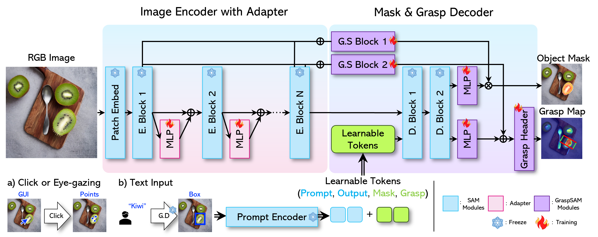
                </td>
            </tr>
        </tbody>
    </table>
</center>

<br>
<br>
<br>
<br>

# Inference GrapSAM in Real World Video

<details>
<summary>Prompt: Prompt-driven Grasp Detection (Prompt: 1point)</summary>
<div markdown="1">

<!-- - **Prompt: Prompt-driven Grasp Detection (Prompt: 1point)** -->

<center>
    <table style="border: none; display: initial;">
        <tbody>
            <tr style="border: none;">
                <video width="80%" controls>
                    <source src="./assets/videos/real_1point.mp4" type="video/mp4">
                    Your browser does not support the video tag.
                </video> 
            </tr>
        </tbody>
    </table>
</center>

</div>
</details>

<br>


<details>
<summary>Prompt: Prompt-driven Grasp Detection (Prompt: 10point)</summary>
<div markdown="1">
<!-- - **Prompt: Prompt-driven Grasp Detection (Prompt: 10point)** -->

<center>
    <table style="border: none; display: initial;">
        <tbody>
            <tr style="border: none;">
                <video width="80%" controls>
                    <source src="./assets/videos/real_10point.mp4" type="video/mp4">
                    Your browser does not support the video tag.
                </video> 
            </tr>
        </tbody>
    </table>
</center>

</div>
</details>

<br>


<details>
<summary>Prompt: Prompt-driven Grasp Detection (Prompt: Box)</summary>
<div markdown="1">
<!-- - **Prompt: Prompt-driven Grasp Detection (Prompt: Box)** -->

<center>
    <table style="border: none; display: initial;">
        <tbody>
            <tr style="border: none;">
                <video width="80%" controls>
                    <source src="./assets/videos/real_bbox.mp4" type="video/mp4">
                    Your browser does not support the video tag.
                </video> 
            </tr>
        </tbody>
    </table>
</center>

</div>
</details>

<br>

<details>
<summary>Prompt: Prompt-driven Grasp Detection (Prompt: Language)</summary>
<div markdown="1">
<!-- - **Prompt: Prompt-driven Grasp Detection (Prompt: Language)** -->

<center>
    <table style="border: none; display: initial;">
        <tbody>
            <tr style="border: none;">
                <video width="80%" controls>
                    <source src="./assets/videos/real_grounding.mp4" type="video/mp4">
                    Your browser does not support the video tag.
                </video> 
            </tr>
        </tbody>
    </table>
</center>

</div>
</details>

<br>


<details>
<summary>Prompt: Prompt-driven Grasp Detection with Eye Gaze</summary>
<div markdown="1">
<!-- - **Prompt: Prompt-driven Grasp Detection with Eye Gaze** -->

<center>
    <table style="border: none; display: initial;">
        <tbody>
            <tr style="border: none;">
                <video width="80%" controls>
                    <source src="./assets/videos/real_gaze.mp4" type="video/mp4">
                    Your browser does not support the video tag.
                </video> 
            </tr>
        </tbody>
    </table>
</center>

</div>
</details>

<br>


## Additional Inference Results

- **Grasp-Anything(Seen)**

<center>
<figcaption>"RGB      Prompt      Pred Mask      Pred Grasp      Grasp Quality Map"</figcaption>
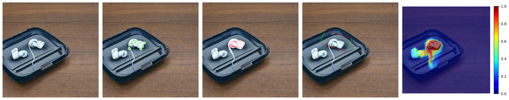
</center>
<center>
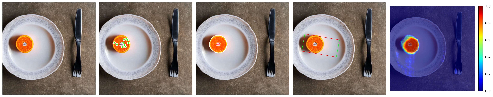
</center>
<center>
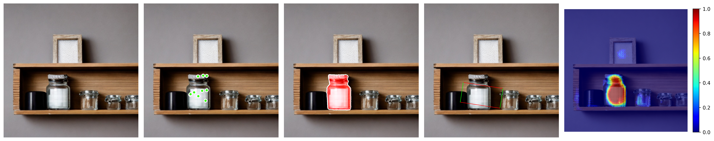
</center>
<center>
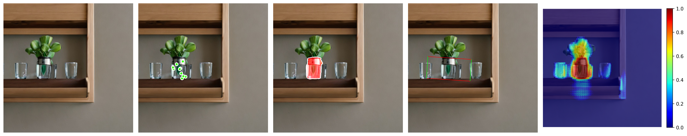
</center>
<center>
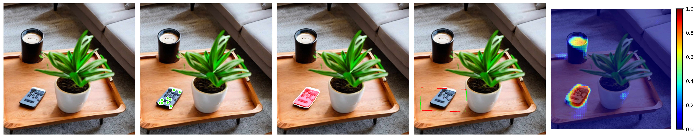
</center>
<center>
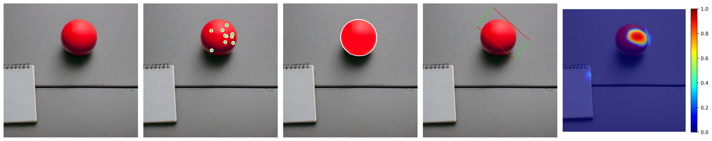
</center>
<center>
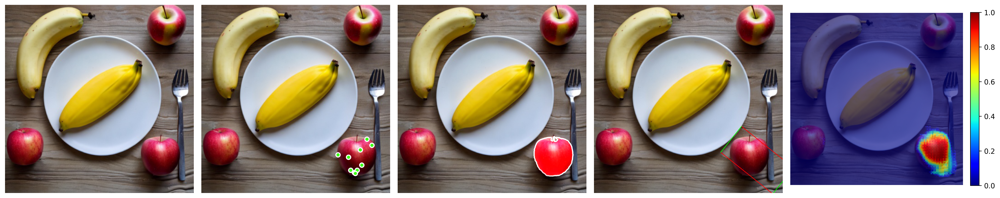
</center>
<center>
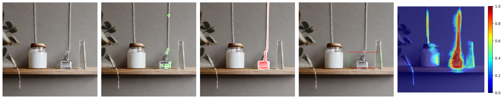
</center>

<br>

- **Grasp-Anything(Unseen)**

<center>
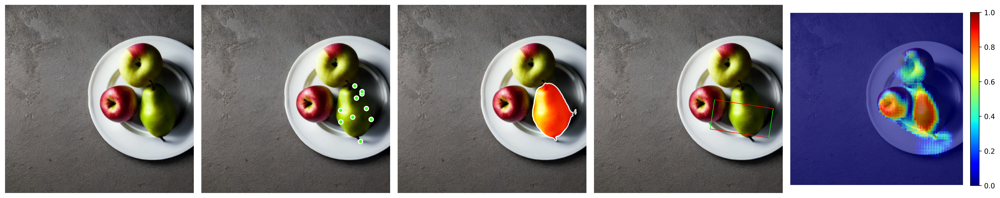
</center>
<center>
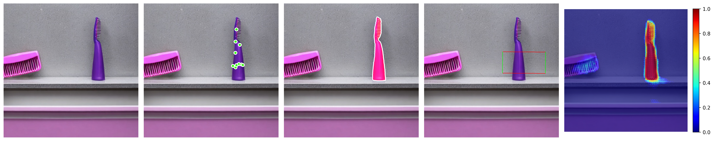
</center>
<center>
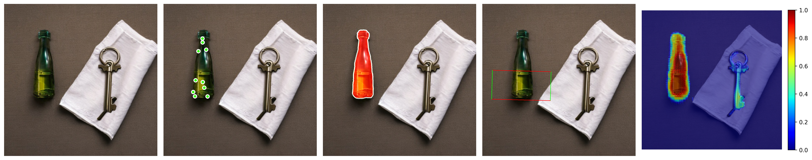
</center>
<center>

</center>
<center>
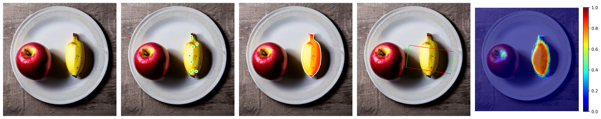
</center>
<center>
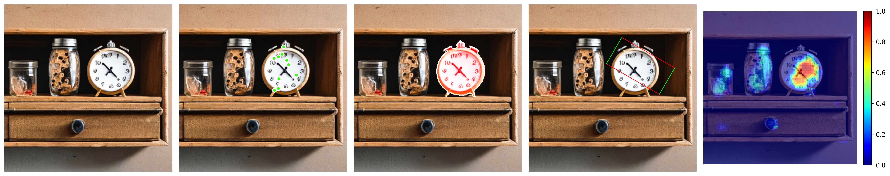
</center>
<center>
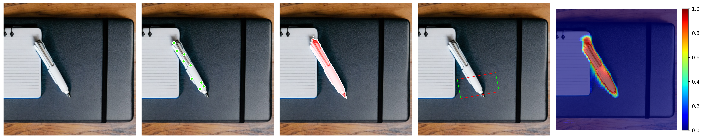
</center>

<br>

- **Armbench**

<center>
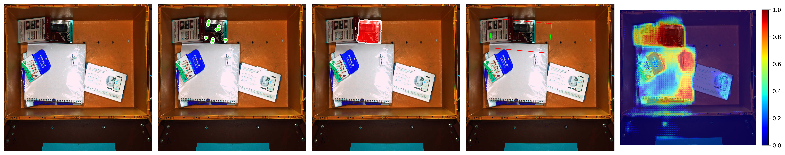
</center>
<center>
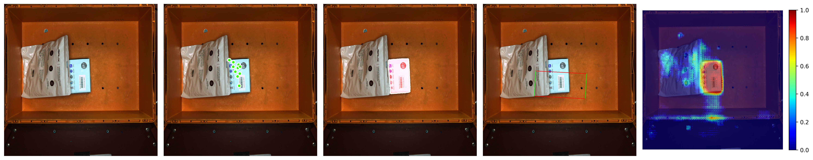
</center>
<center>
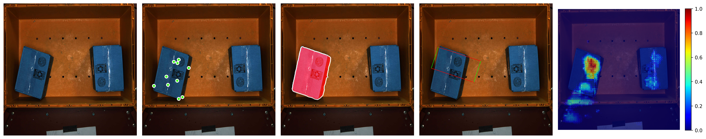
</center>
<center>
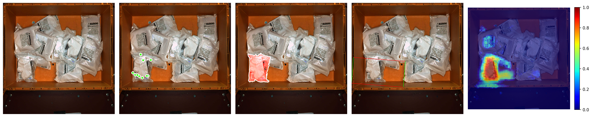
</center>
<center>
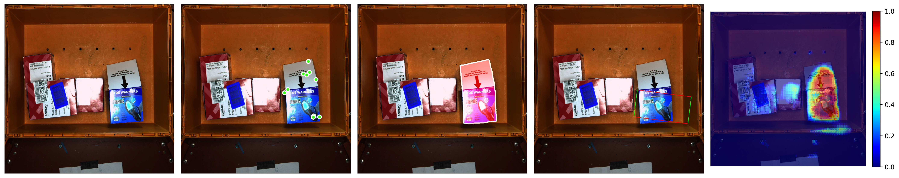
</center>
<center>

</center>

<br>


- **GraspNet**

<center>

</center>
<center>
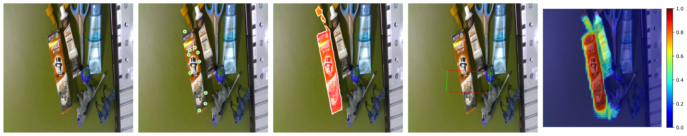
</center>
<center>
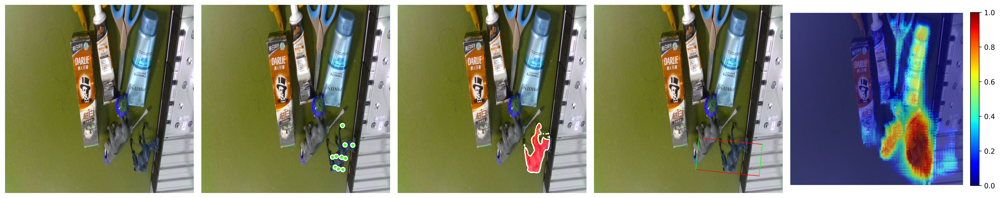
</center>
<center>
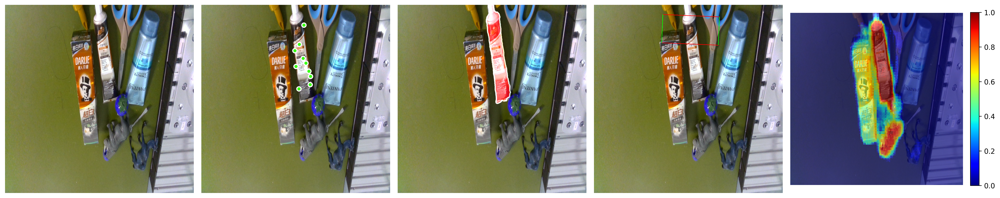
</center>
<center>
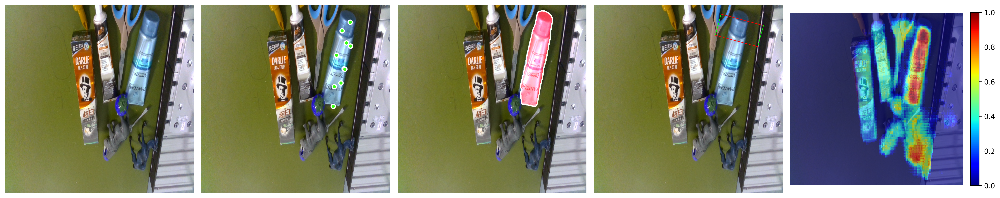
</center>

<br>


- **OCID**

<center>
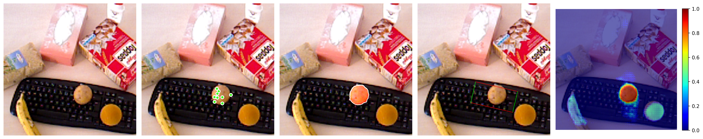
</center>
<center>
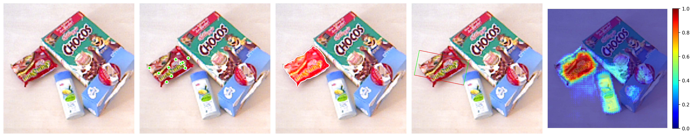
</center>
<center>
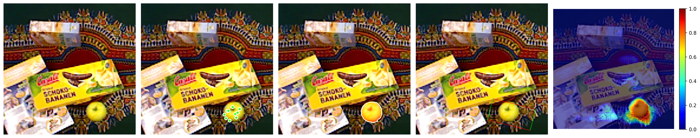
</center>
<center>
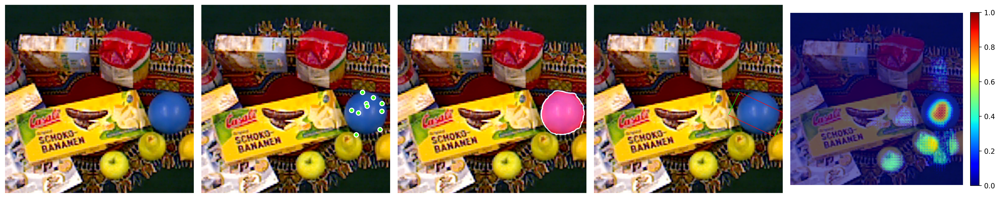
</center>
<center>
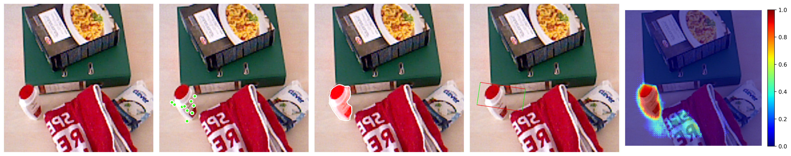
</center>
<center>
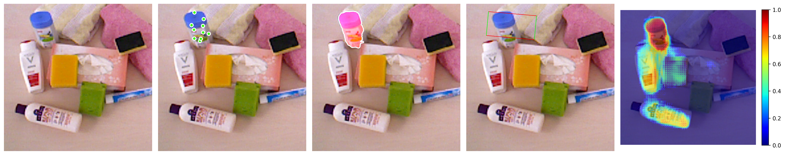
</center>
<center>
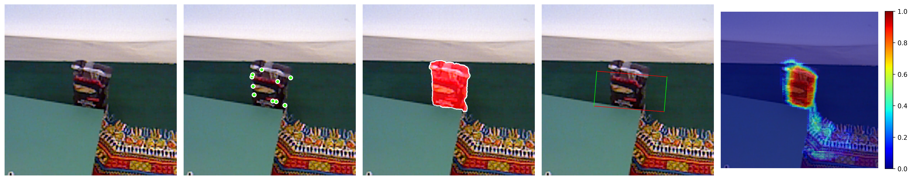
</center>

<br>

<!-- - **Soap tray (Novel Household Object)**

<center>

</center>
<br>

- **Duct tape (Novel Household Object)**

<center>

</center>
<br>

- **Watering can (Novel Household Object)**

<center>

</center>
<br>

- **Wooden bowl (Novel Household Object)**

<center>

</center>
<br> -->

<!-- <br> -->
<!-- <br> -->
<!-- <br> -->
<!-- <br> -->
<!-- <hr style="border: solid 1px #c80000;"> -->
<hr style="#c80000;">
<br>
<br>
<br>
<br>

<!-- # Citation

```
@article{noh2023learning,
  title={Learning to Place Unseen Objects Stably using a Large-scale Simulation},
  author={Noh, Sangjun and Kang, Raeyoung and Kim, Taewon and Back, Seunghyeok and Bak, Seongho and Lee, Kyoobin},
  journal={arXiv preprint arXiv:2303.08387},
  year={2023}
}
``` -->

<br>
<br>
<br>
<br>

<!-- # Acknowledgements

  This work was fully supported by the Korea Institute for Advancement of Technology (KIAT) grant funded by the Korea Government (MOTIE) (Project Name: Shared autonomy based on deep reinforcement learning for responding intelligently to unfixed environments such as robotic assembly tasks, Project Number: 20008613).
  This work was also partially supported by the HPC Support project of the Korea Ministry of Science and ICT and NIPA. -->

<br>
<br>
<br>
<br>

# Author Contacts

<center>
Contact email to get more information on this project<br>
<!-- GIST 광주과학기술원 ([gist.ac.kr](https://www.gist.ac.kr/kr/main.html)) | AILAB GIST AILAB  -->
</center>
<center>
<!-- 
<br> -->

<br>
</center>

<br>
<br>

<center>
    [ Address : Dasan Building (C9) 204/206 & Central Research Facilities (C11) 403, <br>
    123 Cheomdangwagi-ro, Buk-gu, Gwangju, 61005, Korea ]
</center>

<br>
<br>

<footer class="footer">
  <div class="container">
    <div class="content has-text-centered">
      <!-- <a class="icon-link"
         href="./static/videos/nerfies_paper.pdf">
        <i class="fas fa-file-pdf"></i>
      </a> -->
      <center>
        <a class="icon-link" href="https://github.com/keunhong" class="external-link" disabled>website format
            <i class="fab fa-github"></i>
        </a>
      </center>
    </div>
    <div class="columns is-centered">
      <div class="column is-8">
        <div class="content">
          <center>
          <p>
            This website format is licensed under <br>
            a <a rel="license" href="http://creativecommons.org/licenses/by-sa/4.0/">Creative Commons Attribution-ShareAlike 4.0 International License</a>.
          </p>
          </center>
          <!-- <p>
            This means you are free to borrow the <a
              href="https://github.com/nerfies/nerfies.github.io">source code</a> of this website,
            we just ask that you link back to this page in the footer.
            Please remember to remove the analytics code included in the header of the website which
            you do not want on your website.
          </p> -->
        </div>
      </div>
    </div>
  </div>
</footer>
