<br>
<head>
    <!-- <style>
        figure {
            border: 1px #cccccc solid;
            padding: 4px;
            margin: auto;
        }
        figcaption {
            background-color: black;
            color: white;
            font-style: italic;
            padding: 2px;
            text-align: center;
        }
        /* <figure>
            
            <figcaption>Fig.1 - Trulli, Puglia, Italy</figcaption>
        </figure> */
    </style> -->
    <!-- <style type="text/css">
        .avoid {
            page-break-inside: avoid !important;
            margin: 4px 0 4px 0;  /* to keep the page break from cutting too close to the text in the div */
        }
    </style> -->
    <!--  -->
</head>

<center>
    <h1 style="display: block;">
        Learning to Place Unseen Objects Stably<br>
        using a Large-scale Simulation
    </h1>
    <br>
    under review <br>
    <br>
    <!-- Authors ---- ---- ---- ----      ---- ---- ---- ----      ---- ---- ---- ----      ---- ---- ---- ---- -->
    <table style="border: none; display: initial;">
        <tbody>
            <tr style="border: none;">
                <td style="border: none;"><a href="mailto:sangjun7@gm.gist.ac.kr">Sangjun Noh</a><sup>*</sup></td>
                <td style="border: none;"><a href="mailto:raeyo@gm.gist.ac.kr">Raeyoung Kang</a><sup>*</sup></td>
                <td style="border: none;"><a href="mailto:ailab.ktw@gm.gist.ac.kr">Taewon Kim</a><sup>*</sup></td>
                <td style="border: none;"><a href="mailto:shback@gm.gist.ac.kr">Seunghyeok Back</a></td>
                <td style="border: none;"><a href="mailto:bakseongho@gm.gist.ac.kr">Seongho Bak</a></td>
                <td style="border: none;"><a href="mailto:kyoobinlee@gist.ac.kr">Kyoobin Lee</a><sup>†</sup></td>
            </tr>
        </tbody>
    </table>
    <br>
    <table style="border: none; display: initial;">
        <tbody>
            <tr style="border: none;">
                <td style="border: none;">
                    <sup>*</sup>These authors contributed equally to the paper
                </td>
                <td style="border: none;">
                    <sup>†</sup>Corresponding author
                </td>
            </tr>
        </tbody>
    </table>
    <br>
    <table style="border: none; display: initial;">
        <tbody>
            <tr style="border: none;">
                    <sup>1</sup>Gwangju Institute of Science and Technology (GIST)
            </tr>
        </tbody>
    </table>
    <br>
    <br>
    <!-- Links ---- ---- ---- ----      ---- ---- ---- ----      ---- ---- ---- ----      ---- ---- ---- ---- -->
    <table style="border: none; display: initial;">
        <tbody>
            <tr style="border: none;">
                <td style="border: none;">
                    <a href="https://arxiv.org/abs/2303.08387" style="color: #ffffff">
                        <div class="link_button">
                            <!-- <center> -->
                            <i class="bi bi-file-earmark-richtext"></i> Paper
                            <!-- </center> -->
                        </div>
                    </a>
                </td>
                <td style="border: none;"></td> <!-- intervals -->
                <td style="border: none;"></td> <!-- intervals -->
                <td style="border: none; display: initial;">
                    <a href="https://github.com/gist-ailab/uop-net" style="color: #ffffff">
                        <div class="link_button">
                            <!-- <center> -->
                            <i class="bi bi-github"></i> Code / Dataset
                            <!-- </center> -->
                        </div>
                    </a>
                </td>
                <!-- <td style="border: none;"></td> intervals -->
                <!-- <td style="border: none;"></td> intervals -->
                <!-- <td style="border: none;"> -->
                    <!-- <a href="https://www.youtube.com/watch?v=08F4jxSEL7A" style="color: #ffffff"> -->
                        <!-- <div class="link_button"> -->
                            <!-- <center> -->
                            <!-- <i class="bi bi-youtube"></i> Video  -->
                            <!-- </center> -->
                        <!-- </div> -->
                    <!-- </a> -->
                <!-- </td> -->
            </tr>
        </tbody>
    </table>
    <br>
    <table style="border: none; display: initial;">
        <tbody>
            <tr style="border: none;">
                <td style="border: none;">(Official code and dataset will be released at publication.)</td>
            </tr>
        </tbody>
    </table>
    <!-- <br> -->
    <!-- <br> -->
    <!-- <br> -->
    <!-- <br> -->
    <!-- PT video ---- ---- ---- ----      ---- ---- ---- ----      ---- ---- ---- ----      ---- ---- ---- ---- -->
    <!-- <video width="75%" controls autoplay muted loop> -->
        <!-- <source src="./assets/20230901_Home-DataGeneration_01.mp4" type="video/mp4">            TODO: add presentation video -->
        <!-- Your browser does not support the video tag. -->
    <!-- </video>  -->
</center>

<br>
<br>
<br>
<br>

<!-- Paper contents ---- ---- ---- ----      ---- ---- ---- ----      ---- ---- ---- ----      ---- ---- ---- ---- -->

# Abstract

  Object placement is a fundamental task for robots, yet it remains challenging for partially observed objects. Existing methods for object placement have limitations, such as the requirement for a complete 3D model of the object or the inability to handle complex shapes and novel objects, which restrict the applicability of robots in the real world. Our focus was on addressing the Unseen Object Placement (UOP) problem. We tackled the UOP problem using two methods: (1) UOP-Net, a point cloud segmentation based approach that directly detects the most stable plane from partial point clouds, and (2) UOP-Sim, a large-scale dataset to accommodate various shapes and novel objects. Our UOP approach enables robots to place objects stably, even when the object's shape and properties are not fully known, providing a promising solution for object placement in various environments. We verify our approach through simulation and real-world robot experiments, demonstrating state-of-the-art performance for placing single-view and partial objects. For comprehensive findings, please refer to https://sites.google.com/uop-net. (This page)

<br>
<br>
<br>
<br>

# UOP Pipeline

<!-- TODO: add image -->

<center>
    <table style="border: none; display: initial;">
        <tbody>
            <tr style="border: none;">
                <td style="border: none;">
                    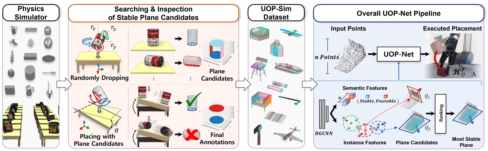
                </td>
                <!-- <td style="border: none;">
                    
                </td> -->
                <!-- <td style="border: none;">
                    
                </td> -->
            </tr>
        </tbody>
    </table>
</center>

<br>
<br>
<br>
<br>

# UOP-Sim Data Generataion

<center>
    <video width="75%" autoplay muted loop>
        <source src="./assets/20230901_Home-DataGeneration_02.mp4" type="video/mp4">
        Your browser does not support the video tag.
    </video> 
</center>

<br>
<br>
<br>
<br>

# UOP-Sim Data Test Set Visualize

<center>
    <table style="border: none; display: initial;">
        <tbody>
            <tr style="border: none;">
                <td style="border: none;">
                    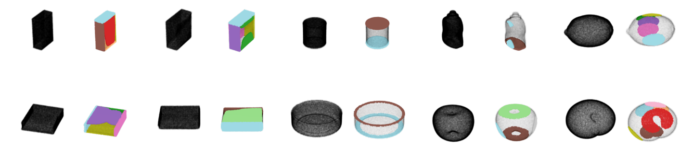
                </td>
                <td style="border: none;">
                    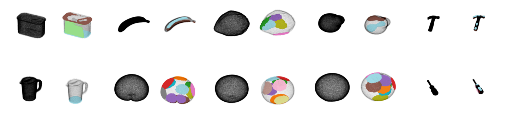
                </td>
            </tr>
        </tbody>
    </table>
</center>
<br>
<center>
    <table style="border: none; display: initial;">
        <tbody>
            <tr style="border: none;">
                <td style="border: none;">
                    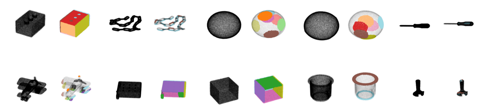
                </td>
                <td style="border: none;">
                    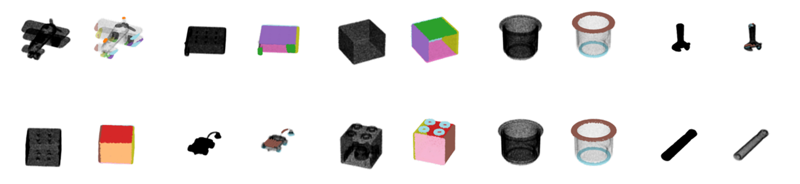
                </td>
            </tr>
        </tbody>
    </table>
</center>
<br>
<center>
    <table style="border: none; display: initial;">
        <tbody>
            <tr style="border: none;">
                <td style="border: none;">
                    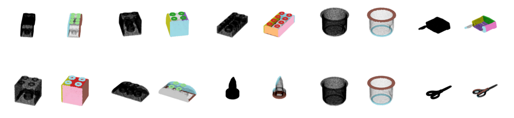
                </td>
                <td style="border: none;">
                    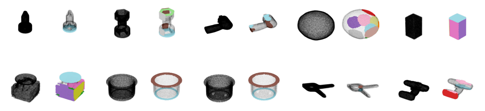
                </td>
            </tr>
        </tbody>
    </table>
</center>
<br>
<center>
    <table style="border: none; display: initial;">
        <tbody>
            <tr style="border: none;">
                <td style="border: none;">
                    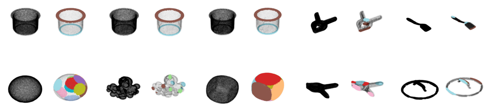
                </td>
                <td style="border: none;">
                    
                </td>
            </tr>
        </tbody>
    </table>
</center>
<br>
<center>
    <table style="border: none; display: initial;">
        <tbody>
            <tr style="border: none;">
                <td style="border: none;">
                    
                </td>
                <td style="border: none;">
                    
                </td>
            </tr>
        </tbody>
    </table>
</center>
<br>

# Inference UOP-Net in Real World

<br>

## Comparison each Result with the YCB Object Set & Novel Household Objects

<!-- TODO: add gif image -->

- **Mustard bottle (YCB objects)**

<center>
    <table style="border: none; display: initial;">
        <tbody>
            <tr style="border: none;">
                <td style="border: none;">
                    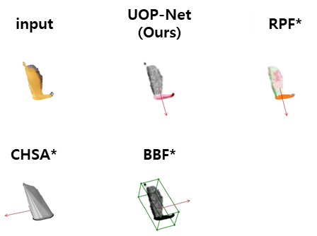
                </td>
                <td style="border: none;">
                    
                </td>
            </tr>
        </tbody>
    </table>
</center>
<br>

- **Potted meat can (YCB objects)**

<center>
    <table style="border: none; display: initial;">
        <tbody>
            <tr style="border: none;">
                <td style="border: none;">
                    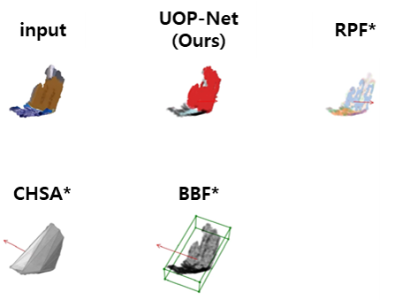
                </td>
                <td style="border: none;">
                    
                </td>
            </tr>
        </tbody>
    </table>
</center>
<br>

- **Sugar box (YCB objects)**

<center>
    <table style="border: none; display: initial;">
        <tbody>
            <tr style="border: none;">
                <td style="border: none;">
                    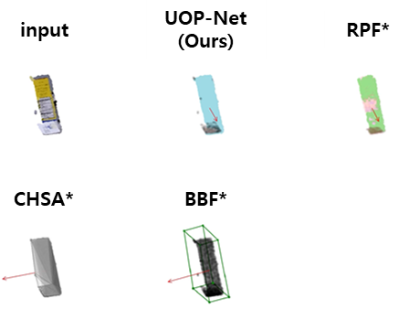
                </td>
                <td style="border: none;">
                    
                </td>
            </tr>
        </tbody>
    </table>
</center>
<br>

- **Toy block (Novel Household Object)**

<center>
    <table style="border: none; display: initial;">
        <tbody>
            <tr style="border: none;">
                <td style="border: none;">
                    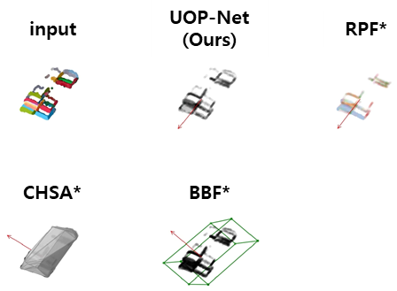
                </td>
                <td style="border: none;">
                    
                </td>
            </tr>
        </tbody>
    </table>
</center>
<br>

- **Toy dinosaur (Novel Household Object)**

<center>
    <table style="border: none; display: initial;">
        <tbody>
            <tr style="border: none;">
                <td style="border: none;">
                    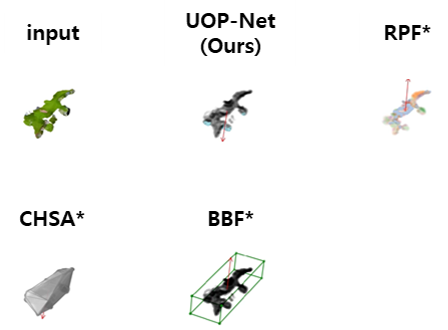
                </td>
                <td style="border: none;">
                    
                </td>
            </tr>
        </tbody>
    </table>
    <br>
</center>
<br>

<br>
<br>
<br>
<br>

## Additional Inference Results (pics)

- **Chips can (YCB Object)**

<center>

</center>
<br>

- **Soap tray (Novel Household Object)**

<center>

</center>
<br>

- **Duct tape (Novel Household Object)**

<center>

</center>
<br>

- **Watering can (Novel Household Object)**

<center>

</center>
<br>

- **Wooden bowl (Novel Household Object)**

<center>

</center>
<br>

<br>
<br>
<br>
<br>
<!-- <hr style="border: solid 1px #c80000;"> -->
<hr style="#c80000;">
<br>
<br>
<br>
<br>

# Citation

```
@article{noh2023learning,
  title={Learning to Place Unseen Objects Stably using a Large-scale Simulation},
  author={Noh, Sangjun and Kang, Raeyoung and Kim, Taewon and Back, Seunghyeok and Bak, Seongho and Lee, Kyoobin},
  journal={arXiv preprint arXiv:2303.08387},
  year={2023}
}
```

<br>
<br>
<br>
<br>

# Acknowledgements

  This work was fully supported by the Korea Institute for Advancement of Technology (KIAT) grant funded by the Korea Government (MOTIE) (Project Name: Shared autonomy based on deep reinforcement learning for responding intelligently to unfixed environments such as robotic assembly tasks, Project Number: 20008613).
  This work was also partially supported by the HPC Support project of the Korea Ministry of Science and ICT and NIPA.

<br>
<br>
<br>
<br>

# Authors & Contacts

<center>
Contact email to get more information on the project<br>
<br>
<!-- GIST 광주과학기술원 ([gist.ac.kr](https://www.gist.ac.kr/kr/main.html)) | AILAB GIST AILAB  -->
</center>
<br>

<center>
<!-- 
<br> -->

<br>
</center>

<br>

<center>
    [ Address : Dasan Building (C9) 204/206 & Central Research Facilities (C11) 403, <br>
    123 Cheomdangwagi-ro, Buk-gu, Gwangju, 61005, Korea ]
</center>

<br>
<br>

<footer class="footer">
  <div class="container">
    <div class="content has-text-centered">
      <!-- <a class="icon-link"
         href="./static/videos/nerfies_paper.pdf">
        <i class="fas fa-file-pdf"></i>
      </a> -->
      <center>
        <a class="icon-link" href="https://github.com/keunhong" class="external-link" disabled>website format
            <i class="fab fa-github"></i>
        </a>
      </center>
    </div>
    <div class="columns is-centered">
      <div class="column is-8">
        <div class="content">
          <p>
            This website format is licensed under a <a rel="license" href="http://creativecommons.org/licenses/by-sa/4.0/">Creative Commons Attribution-ShareAlike 4.0 International License</a>.
          </p>
          <!-- <p>
            This means you are free to borrow the <a
              href="https://github.com/nerfies/nerfies.github.io">source code</a> of this website,
            we just ask that you link back to this page in the footer.
            Please remember to remove the analytics code included in the header of the website which
            you do not want on your website.
          </p> -->
        </div>
      </div>
    </div>
  </div>
</footer>